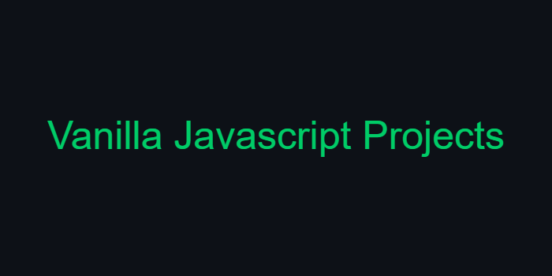

> This is the main repository for the projects

## Description
An open source project for mini vanilla Javascript projects with HTML&CSS(SASS).

## What's For?
* Beginner-mid level students/learners for practicing or using it.
* contribution, There is a lots of things need to improve

---

|*| Project | Live Demo |
|:-:| :--------: | :---------: |
|01| [Writing Text Animation](https://github.com/stevePHXela/vanilla-javascript-projects/tree/master/Writing%20Text%20Animation) | [Live Demo](https://codepen.io/steveFkela/pen/yLKMvpN) |
|02| [Search Bar Animation](https://github.com/stevePHXela/vanilla-javascript-projects/tree/master/Search%20Bar%20Animation) | [Live Demo](https://codepen.io/steveFkela/pen/WNzjYzr) |
|03| [Convert Degrees To Radians](https://github.com/stevePHXela/vanilla-javascript-projects/tree/master/Convert%20Degress%20To%20Radians) | [Live Demo]() |
|04| [Auto Dark Mode](https://github.com/stevePHXela/vanilla-javascript-projects/tree/master/Auto%20Dark%20Mode) | [Live Demo]() |

---

## Contribute
* Can be changing/improve the **Styling** and the **Code** without changing the idea of the project.
* Using only vanilla **Javascript** no libraries or frameworks.
* We are using **SASS** for the styling , Can be use just *css* but will be better to use sass.
* only mini-simple web project the point is to target starter/mid lever *learner*.

## Licenses
Open source Project!
